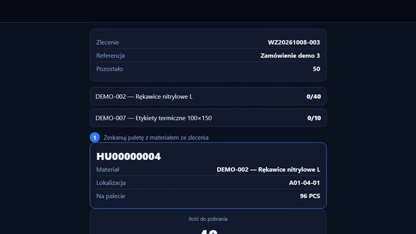
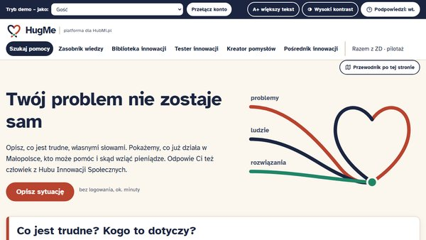
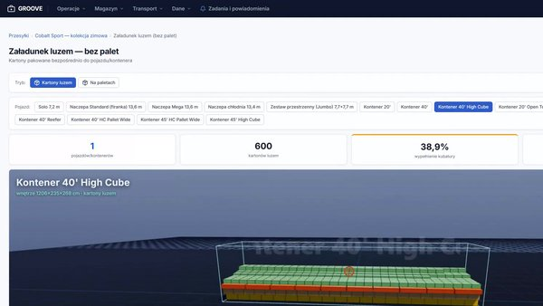
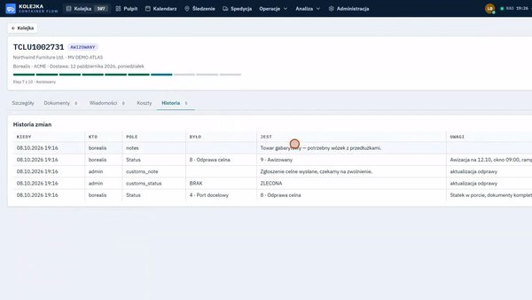
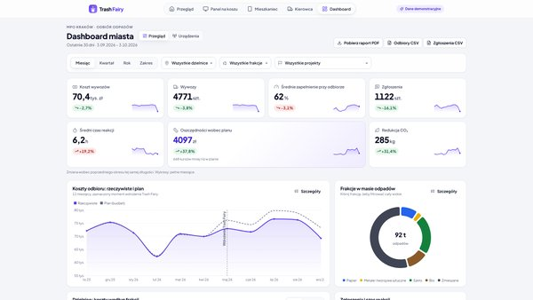
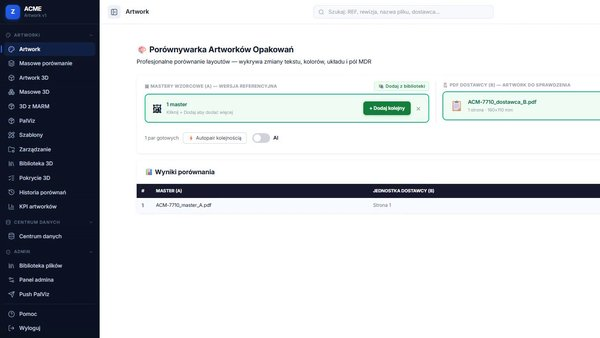

# Tomasz Wierzbowski

Buduję oprogramowanie dla logistyki i magazynu — od paletyzacji i modelu hali 3D, przez
kontrolę jednostek logistycznych (HU) na skanerach, po kolejkę kontenerów i obieg
dokumentów handlowych. Python (Django, Flask, FastAPI), PostgreSQL, Docker, CI/CD.

## Interfejsy

| | | |
|---|---|---|
|  **[mini-WMS](https://github.com/TomaszWu14/mini-WMS)** — skaner: praca jedną ręką, duże pola i klawiatura numeryczna zamiast pisania. |  **[hugme](https://github.com/TomaszWu14/hugme)** — WCAG 2.1 AA bez JavaScriptu: wysoki kontrast, większy tekst, prosty język. |  **[palviz-portfolio](https://github.com/TomaszWu14/palviz-portfolio)** — własny design system dla kilkunastu modułów i widok 3D, który da się czytać operacyjnie. |
|  **[container-queue](https://github.com/TomaszWu14/container-queue)** — gęste tabele operacyjne w trzech językach, czytelne przy setkach kontenerów. |  **[trash-fairy](https://github.com/TomaszWu14/trash-fairy)** — mapy, PWA dla kierowcy i kiosk na koszu: jeden system, trzy bardzo różne ekrany. |  **[artwork-checker](https://github.com/TomaszWu14/artwork-checker)** — dziesiątki różnic między dwoma PDF podane tak, żeby od razu było widać te krytyczne. |

## Magazyn i logistyka

| Projekt | Co robi | Stack |
|---|---|---|
| [palviz-portfolio](https://github.com/TomaszWu14/palviz-portfolio) | Platforma magazynowa: paletyzacja 3D, model magazynu z heatmapą, kontrola HU, planowanie transportu | Django, PostgreSQL, three.js, OR-Tools |
| [container-queue](https://github.com/TomaszWu14/container-queue) | Kolejka kontenerów dla kilku spółek: awizacje, śledzenie statków (AIS), zlecenia spedycyjne, import SAD | FastAPI, React, PostgreSQL |
| [mini-WMS](https://github.com/TomaszWu14/mini-WMS) | Lekki WMS: HU z etykietami QR, lokalizacje, picking FEFO/FIFO, rejestr ruchów | Django |
| [rcp-strefy](https://github.com/TomaszWu14/rcp-strefy) | Czas pracy w strefach magazynu: KPI, zgłoszenia korekt, zakres danych wg roli | Flask, pandas/Parquet |

Wszystkie: [`topic:warehouse-logistics`](https://github.com/TomaszWu14?tab=repositories&q=topic%3Awarehouse-logistics)

## Dokumenty i jakość

| Projekt | Co robi | Stack |
|---|---|---|
| [doccompare](https://github.com/TomaszWu14/doccompare) | Porównywanie dokumentów handlowych (PO/PI/CI/PL/SAD) i workflow zakupy → transport → cło | Flask, PDF/OCR |
| [artwork-checker](https://github.com/TomaszWu14/artwork-checker) | Porównywanie projektów opakowań z masterami, walidacja EAN/GS1, podgląd 3D | Flask |

Wszystkie: [`topic:document-processing`](https://github.com/TomaszWu14?tab=repositories&q=topic%3Adocument-processing)

## Hackathony (HackYeah 2026)

| Projekt | Co robi | Stack |
|---|---|---|
| [hugme](https://github.com/TomaszWu14/hugme) | Platforma dla HubMi.pl: łączenie problemów społecznych z innowacjami, WCAG 2.1 AA | Flask |
| [trash-fairy](https://github.com/TomaszWu14/trash-fairy) | Planowanie odbioru odpadów w mieście: zgłoszenia, prognoza zapełnienia, trasy | Flask, OR-Tools |

Wszystkie: [`topic:hackathon`](https://github.com/TomaszWu14?tab=repositories&q=topic%3Ahackathon)

---

Projekty z pracy są opublikowane jako wersje portfolio: nazwy firm zamienione, dane
demo i testowe syntetyczne. Pełna lista: [`topic:portfolio`](https://github.com/TomaszWu14?tab=repositories&q=topic%3Aportfolio).
